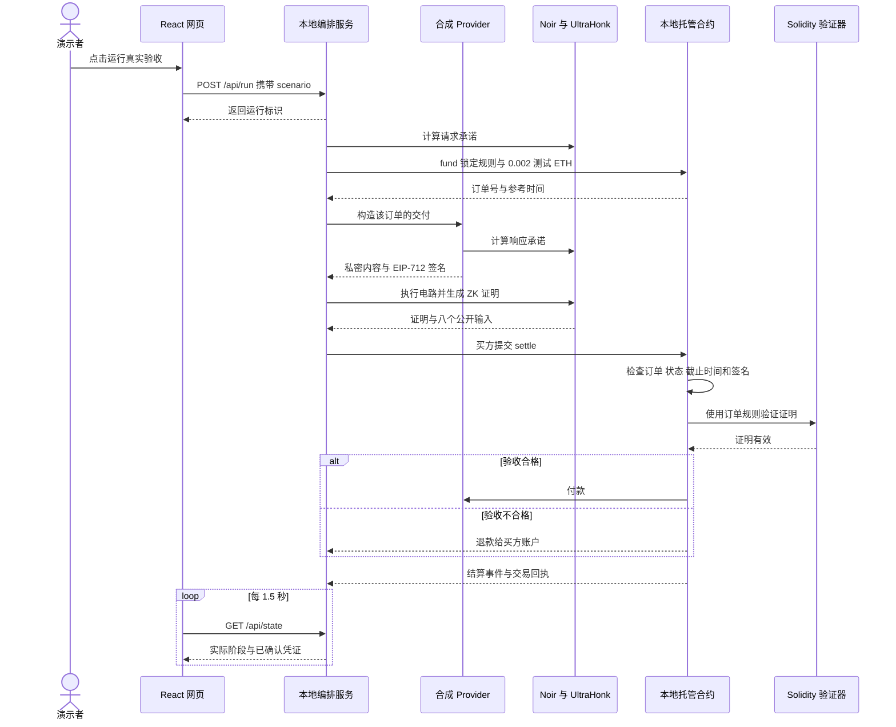
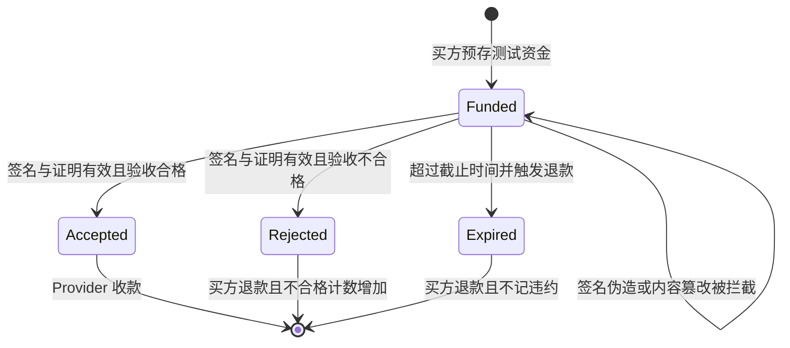

# VeilReceipt 操作背后的技术

VeilReceipt 把一次验收拆成三件事：Provider 对私密内容的承诺签名，零知识电路证明这些内容是否满足订单规则，合约验证证据并执行资金结算。

本指南与 [操作指南](USER_GUIDE.zh-CN.md) 的 O01 至 O20 一一对应。阅读时可以先完成一个操作，再看这里的请求、数据和合约变化。实现基准为 2026 年 10 月 7 日的 0.1.0 版本。

## 先理解四个角色

| 角色 | 持有什么 | 负责什么 |
| --- | --- | --- |
| 买方 Agent | 私密请求、收到的响应、随机盲因子 | 发起订单、生成验收证明、提交结算 |
| Provider | 自己交付的内容和签名密钥 | 对订单及请求和响应承诺签名 |
| 验证与托管合约 | 订单、承诺、规则、测试资金和公开证据 | 验签、验证证明、付款或退款、防止重复结算 |
| 外部核验者 | 公共 JSON 凭证、可信 RPC 和合约地址 | 重新核对签名、规则、证明与实际结算 |

当前本地 Node 服务同时模拟买方和 Provider，并运行 prover 与 Ganache。角色在协议中有分工，在演示中尚未拆成彼此独立的生产服务。公共凭证观察者拿不到原始响应，本机演示进程则知道输入。

## 一次真实验收的完整调用



图中的角色是逻辑分工。当前 Provider 和 prover 通过同一进程内的函数协作，不是实际调用外部数据商 HTTP API。

## O01 启动时创建了什么

`npm ci` 按锁文件安装依赖。`npm run bootstrap` 下载固定版本 Nargo，编译两个 Noir 电路，准备公开 SRS 参数，生成 Solidity 验证器，并编译合约 ABI 与字节码。

`npm start` 启动 Express、Noir / Barretenberg WASM prover，以及 Chain ID 为 31337 的 Ganache EVM。有效的原部署可以复用；新环境会部署验证器和托管合约。账本保存在 `.runtime/chain`，部署地址保存在 `.runtime/deployment.json`。

买方交易由本地开发账户自动签署，Provider 用另一开发账户签名，所以页面无需 MetaMask。真实交易执行在本地 EVM，节点不依赖公共 Ethereum 网络。

前端生产资源由 Vite 构建，Express 从 `dist` 提供。服务绑定 `127.0.0.1`，并校验 Host 与 Origin。

源码：[启动准备](../scripts/bootstrap.mjs)、[证明服务](../server/prover.mjs)、[本地链](../server/chain.mjs)、[HTTP 服务](../server/index.mjs)。

## O02 介绍页如何呈现原理

十章介绍由 React 的 `Story` 组件渲染。当前章节保存在 `#/story?chapter=N` 中，切换章节修改网址片段，不创建订单。

章节导航、消息流下拉框和技术标签切换组件状态；“放大图解”使用原生 `dialog`，关闭后把焦点还给触发按钮。图解来自静态素材，按钮、标题和说明文字由网页渲染。

第 8 章的原件和篡改实验只切换教学状态，不调用 `/api/verify`。进入真实演示的链接把场景参数交给 `Lab`，仍需用户显式运行；真实密码学操作从 O03 或 O12 开始。

源码：[Story](../src/components/Story.jsx)、[页面路由](../src/main.jsx)。

## O03 点击合格交付后发生了什么

### 发起与防重复点击

`Session.launch('valid')` 请求 `POST /api/run`，服务立即返回运行 UUID，后续任务在本地继续执行。前端有启动锁，服务有全局 `busy` 锁；已有运行时拒绝新任务，避免重复点击创建多笔订单。

UUID 用于页面追踪进度，合约订单号则来自 `fund` 发出的事件，两者不是同一个标识。

### 固定订单规则

买方调用 `ReceiptEscrow.fund`，存入 0.002 测试 ETH，并保存 Provider 地址、请求承诺和验收规则：

| 条件 | 默认值与含义 |
| --- | --- |
| `maxAge` | 120 秒，响应相对订单参考时间的最大年龄 |
| `minSamples` | 至少 100 条样本 |
| `minConfidence` | 至少 9000 bps，即 90% |
| `referenceTime` | 创建订单所在区块的时间 |
| `deadline` | 参考时间加 3600 秒，提交结算的截止时间 |
| 其他电路条件 | 请求和响应标的一致；置信度不超过 100%；价格大于零 |

这些阈值在当前网页中是固定配置，没有让观众临时修改的输入框。签名后的验收使用合约已经保存的规则。

### 用承诺连接私密内容

承诺可以理解为带随机盲因子的内容指纹。当前实现使用适合电路计算的 Poseidon2，对固定结构的数值字段计算：

```text
请求承诺 = Poseidon2(1, 请求标的, 请求盲因子)

响应承诺 = Poseidon2(
  2, 订单号, 请求承诺, 响应标的, 观察时间,
  样本数量, 置信度, 价格, 响应盲因子
)
```

前面的 1 和 2 区分请求与响应。响应同时绑定订单号和请求承诺，减少把另一笔交付移来使用的空间。随机盲因子让公开承诺不只是低熵行情字段的可猜测哈希；它不是用于解密的密码。

电路使用的是固定 schema，而不是把任意原始 JSON 直接放进去做 SHA-256 或 Keccak。

### Provider 签署什么

Provider 使用 EIP-712 签署 `orderId`、`requestCommitment`、`responseCommitment` 和 `policyId`。签名域同时绑定协议名、版本、Chain ID 和托管合约地址。

`policyId` 标记规则版本；具体阈值从该订单存储中读取。签名不直接给“合格”背书，而是认领这一笔交付的内容承诺。合约验签，电路计算是否达标，分工清晰。

### 零知识证明真正约束什么

JavaScript 先计算预期结论，并把它与私密字段一起交给 Noir。电路自己重算两个承诺和验收结果，必须同时满足：

```text
重算的请求承诺 == 订单请求承诺
重算的响应承诺 == Provider 签署的响应承诺
按规则计算的真实结果 == 公开的 outcome
```

所以 JavaScript 传入一个“合格”标记并不足以让订单付款；不一致的 witness 无法满足电路约束。

八个公开输入依次为：订单号、请求承诺、响应承诺、参考时间、最大数据年龄、最低样本数量、最低置信度、验收结果。原始标的、响应字段和盲因子是私密 witness，不进入公共输入列表。

Noir 执行得到 witness；bb.js 使用启用零知识的 UltraHonk EVM 模式生成证明，再先做一次本地校验。私密输入留在本机证明流程中。

### 合约怎样付款

买方调用 `settle(orderId, responseCommitment, accepted, signature, proof)`。合约依次检查订单存在、尚未结算、调用者是买方、未超过截止时间、承诺范围合法、签名属于指定 Provider，然后从订单存储组装公开输入并调用 Solidity verifier。

证明有效且 `accepted=true` 时，合约将状态改为 Accepted，增加 Provider 的合格计数，发出 `ReceiptSettled` 事件，并把托管款转给 Provider。状态先更新、转账后执行，并使用重入保护；转账失败则整笔交易回滚。

服务等待交易回执确认后才生成公共凭证。网页从实际状态显示“已付款”，动画不决定资金结果。

源码：[前端会话](../src/session.jsx)、[订单编排](../server/protocol.mjs)、[承诺与规则](../circuits/schema/src/lib.nr)、[验收电路](../circuits/receipt/src/main.nr)、[托管合约](../contracts/ReceiptEscrow.sol)。

## O04 为什么过期交付仍能生成有效证明

`stale` 场景把观察时间设为订单参考时间减 600 秒，超过 120 秒阈值。电路计算出的验收结果为 false，公开 `outcome` 也为 false，两者一致，因此能够生成有效证明。

合约仍然验签和验证证明。验证成功后，将订单标为 Rejected，增加不合格计数，款项退给订单买方。

这里证明的命题是“这份签署内容按约定规则得出的结论为不合格”。证明有效性和交付合格性是两个独立维度。

数据新鲜度相对订单参考时间计算；等待网页几秒不会自动把一份 `valid` 场景变成 `stale`。订单提交截止时间则由合约另行检查。

源码：[prepareDelivery 与 verdict](../server/protocol.mjs)、[电路结果约束](../circuits/receipt/src/main.nr)。

## O05 样本不足如何转化为退款

`low-quality` 场景把签署的 `sample_count` 设为 24，低于订单的 100。其余流程和过期交付相同：证明有效、结果为 false、合约退款。

本电路比较 Provider 声明并承诺的样本数量和置信度字段，不会重新统计真实市场上的样本或重算统计置信度。这是当前验收 schema 的具体含义。

源码：[场景参数](../server/protocol.mjs)、[阈值判断](../circuits/schema/src/lib.nr)。

## O06 篡改私密内容在哪里被拦截

`tampered` 场景先完成正常内容承诺和 Provider 签名，再将交给证明器的价格字段增加 1,000,000 个微单位，即 1 个价格单位，保留原承诺。

电路用新价格重算响应承诺，发现与已签署承诺不一致，在 witness 执行阶段约束失败。服务不再发起结算，因此结果是“已拦截、资金仍在托管”，不是负面证明退款。

源码：[runScenario 中的 tampered 分支](../server/index.mjs)、[响应承诺检查](../circuits/receipt/src/main.nr)。

## O07 伪造来源在哪里被拦截

`forged` 场景用陌生开发账户替代指定 Provider 签名。服务通过 `settle.staticCall` 做合约预执行；签名恢复出的地址与订单中的 Provider 不同，触发 `InvalidSignature`。

这条演示分支在签名检查处停止，没有生成正常证明，也不广播失败结算交易。预存订单真实存在，资金等待后续处理。

ECDSA 验签在 Solidity 中执行，Noir 电路不承担 ECDSA 验签开销。

源码：[签名构造](../server/protocol.mjs)、[伪造来源分支](../server/index.mjs)、[合约 settle](../contracts/ReceiptEscrow.sol)。

## O08 到期退款为什么不需要证明

前端请求 `POST /api/runs/:id/expire`。服务确认这是留下订单的被拦截运行，再对本地 Ganache 调用 `evm_increaseTime` 和 `evm_mine`，最后发送 `refundExpired(orderId)` 交易。

合约只要求订单仍处于 Funded 且当前区块时间已超过截止时间。任何调用者都可触发这个到期路径，退款收款人固定为原订单买方，不能由调用者指定。

订单状态变为 Expired，并发出 `OrderExpired` 事件。它不调用 ZK 验证器，不增加 acceptedCount 或 rejectedCount，也不生成普通 `ReceiptSettled` 交付凭证。

推进时钟仅是本地演示便利功能；真实网络中的到期需要等待实际区块时间。

以下状态图将三种资金去向放在一起。被拦截并不是一种新的链上订单状态，此时订单仍为 Funded。



源码：[expire 接口](../server/index.mjs)、[refundExpired](../contracts/ReceiptEscrow.sol)。

## O09 规则与执行证据来自哪里

规则面板展示当前固定政策。服务在资金托管、收到签名、证明生成、链上验证、结算等步骤记录时间戳，`GET /api/state` 返回这些运行记录。

前端每 1.5 秒读取一次状态，再由 `runView` 分别计算“证明”“验收”“资金”的展示文字。它没有模拟一个匀速增长的证明进度条。

`proveMs` 记录 backend 生成证明的耗时，不含 witness 执行、资金托管、交易确认和整次运行。区块号、交易哈希与 gas 使用量来自交易回执。复制交易号只是调用浏览器 Clipboard API，不发送交易。

源码：[stage 与 state 接口](../server/index.mjs)、[prove 计时](../server/prover.mjs)、[runView](../src/model.js)、[Lab](../src/components/Lab.jsx)。

## O10 私密样本怎样按需读取

公共 `/api/state` 不返回私密响应字段。只有显式打开本机样本时，页面才请求 `GET /api/private/:runId`；关闭或切换运行时终止尚未结束的请求。

样本来自服务内存中的 `privateInputs`，页面显示其中几个业务字段。页面上的锁和封存外观是隐私状态的表达，不是在浏览器里把已经公开下载的原文做模糊处理。

当前本机样本接口没有生产身份认证。它适用于合成数据演示；隐私保证针对公共凭证，不针对能够读取此演示进程或访问该本机接口的人。收起视图不会撤销已经查看过的内容。

源码：[private 接口与内存存储](../server/index.mjs)、[按需加载](../src/components/Lab.jsx)。

## O11 JSON 凭证包含什么

服务的 `publicReceipt` 把订单、承诺、签名、ZK 证明和结算定位信息序列化为 `veilreceipt.public-receipt.v1`。

| 公开内容 | 用途 |
| --- | --- |
| 网络、合约与双方地址 | 定位部署并与核验者信任锚比对 |
| 订单号、政策、参考时间、截止时间和金额 | 还原订单上下文 |
| 签名域、签署消息与签名 | 检查来源承诺 |
| 证明、公开输入与验收结果 | 重做密码学验证 |
| 托管与结算交易哈希、区块、收款人和金额 | 查链核对资金结果 |
| 性能和说明字段 | 帮助展示与调试 |

原始请求标的、响应业务字段和随机盲因子不导出。不是 JSON 中每个说明字段都受密码学认证：例如 `proveMs`、`verifyMs`、`proofBytes` 和文字说明不是验收结论本身，当前核验器不逐一证明它们真实。

本地订单的下载使用 `GET /api/receipts/:orderId`。核验页的“下载当前原始凭证”则将当前原件对象转为 Blob 下载，避免把外部文件的订单号误当成本地记录索引。

源码：[publicReceipt](../server/protocol.mjs)、[下载接口](../server/index.mjs)、[Verifier 下载](../src/components/Verifier.jsx)。

## O12 导入时怎样重新核验

浏览器先限制文件大小并解析 JSON，再把对象提交到 `POST /api/verify`。服务直接验证这份对象，不要求它已经存在于本地凭证列表。

核验器固定自己的链与 escrow 地址，不接受文件指定的新信任锚。八组检查如下：

| 检查 | 核验内容 |
| --- | --- |
| 凭证格式 | schema、结果类型、币种与政策名称 |
| 可信部署 | 签名域、Chain ID、托管合约及验证器地址 |
| 来源签名 | 用可信签名域恢复签署者，匹配链上订单 Provider |
| 订单与规则 | 订单存储、承诺、规则、金额、时间、双方地址与托管事件 |
| 公开输入 | 合约按订单重建的八个输入与凭证输入逐项一致 |
| 零知识证明 | 调用可信 Solidity verifier 检查证明 |
| 结算事件 | 成功回执、区块、gas 使用量以及事件中的订单、承诺、结果、金额和 Provider |
| 最终状态 | 合约订单确实处于与 outcome 一致的 Accepted 或 Rejected |

八组全部通过才返回 `valid: true`。出现解析或验证异常时返回拒绝结果；HTTP 连接失败时前端显示“核验暂不可用”，不能把没有结果当作密码学拒绝。

复验只读链和调用 verifier，不产生新资金结算。持有 JSON 本身仍不足以判断哪条链可信，这一步由核验者独立确定。

源码：[文件导入](../src/components/Verifier.jsx)、[verifyReceipt](../server/verify.mjs)。

## O13 翻转公开结论为什么会失败

前端深拷贝原件，仅把 `outcome` 从 true 改为 false 或反向改写，再提交核验，保留原件供恢复。

`outcome` 是电路公开输入之一。修改它后，凭证公开输入与合约重建的输入不一致；原证明也不能支持新的命题。如果继续检查链上结算事件与最终状态，它们同样对应原结论。

`verifyReceipt` 遇到验证器抛错可能提前结束，因此 UI 不一定展示所有理论上会失败的后续项。这是拒绝路径的表现，不代表页面改动了原订单。

源码：[tamper](../src/session.jsx)、[输入与证明检查](../server/verify.mjs)。

## O14 防止一份证据重复领钱

按钮请求 `POST /api/receipts/:id/replay`。服务拿同一订单、承诺、结果、签名和证明，再执行 `settle.staticCall`。

合约只允许 Funded 状态结算一次。Accepted、Rejected 或 Expired 的订单再次调用都会触发 `AlreadyFinalized`；签名域和订单绑定还限制跨链、跨合约、跨订单复用。

这个按钮验证拒绝原因，不广播重放交易。真正的约束来自合约状态机，不依赖前端隐藏按钮或记录“已经点过”。

源码：[replay 接口](../server/index.mjs)、[订单状态判断](../contracts/ReceiptEscrow.sol)。

## O15 公共列表与信誉计数如何生成

列表来自本地服务保存的公共凭证；筛选在 React 内按 outcome 过滤。点击“核验”将选中的凭证传给同一个核验流程，下载则读取对应 JSON。

顶部合格与不合格计数读取合约的 `acceptedCount(provider)` 和 `rejectedCount(provider)`；托管余额读取链上合约余额。因此列表是本地索引，计数和余额来自本地链。

当前没有跨 Provider 排名、抗女巫机制或 ERC-8004 注册表。计数的含义是这个部署中被有效证据结算的次数。

源码：[公共凭证页面](../src/components/Receipts.jsx)、[state 接口](../server/index.mjs)、[合约计数](../contracts/ReceiptEscrow.sol)。

## O16 部署地址为什么必须独立确定

技术说明页从当前服务状态显示网络、escrow 和 verifier 地址。网页核验器使用当前服务的部署上下文，而非从上传文件选择合约。

否则，伪造者可以把“总是返回通过”的合约地址写进文件，引导核验者去问它。命令行工具要求显式传入可信 escrow，然后从这个 escrow 读取 verifier 地址，从 RPC 读取 Chain ID，构造可信核验上下文。

链与 RPC 仍是信任基础：当前本机操作员控制本地链，独立进程复验不等于独立公共网络的见证。

源码：[技术说明页](../src/components/Protocol.jsx)、[命令行信任锚](../scripts/verify-receipt.mjs)。

## O17 讲稿和演示辅助操作如何实现

讲稿开关、三幕导航、提示条和减少动效开关使用 React 状态；全屏与复制使用浏览器标准 API。技术标签与演示标签提供键盘焦点和方向键操作，图解用原生模态框管理焦点。

初始动效模式读取系统 `prefers-reduced-motion` 偏好，页脚按钮可在当前页面会话中切换。页面路由改变时把焦点移到主要内容，异步结果通过 `aria-live` 提示。

这些属于呈现层，没有签名、证明或转账副作用。章节快捷键在输入控件中不接管按键，运行期间也不切换当前演示章节。

源码：[App](../src/main.jsx)、[Lab](../src/components/Lab.jsx)、[Story](../src/components/Story.jsx)、[样式](../src/styles.css)。

## O18 断连后哪些状态会恢复

| 状态 | 存放位置 | 恢复行为 |
| --- | --- | --- |
| 页面选中的运行和演示章节 | 浏览器 sessionStorage | 同一标签页通常可恢复；显式选择新场景会清掉当前运行选择 |
| 上传原件、当前核验结果、打开的样本视图 | React 内存 | 页面刷新后需重新操作 |
| 公共运行记录与凭证 | `.runtime/state.json` | 同一部署重启时重新加载 |
| 交易、合约状态与余额 | `.runtime/chain` | 保留账本才能继续查原交易 |
| Provider 私密合成样本 | Node 进程内存 | 服务重启后不恢复 |

HTTP 请求失败时，前端标记断连并保留最后确认状态；后台刷新和“重新连接”都尝试再次读取 `/api/state`。普通请求有 20 秒客户端超时，它不等于链上订单的 3600 秒截止时间。

服务把尚未完成的历史运行标为中断；如果已记录订单号，就能提供到期退款入口。公共状态写入采用临时文件加重命名，减少中途截断文件的风险，但这不是跨 HTTP 状态文件与链账本的完整事务恢复系统。

源码：[Session 持久选择与轮询](../src/session.jsx)、[请求超时](../src/model.js)、[状态加载与保存](../server/index.mjs)。

## O19 Agent 调用与命令行核验复用了什么

`scripts/agent-demo.mjs` 是确定性的工具客户端：提交场景、轮询运行、下载凭证。它与网页调用相同的 API，不使用另一套假结算逻辑，也不需要 LLM 推理。最长等待 120 秒是客户端等待上限；超时后须先检查订单状态，不能假设订单没创建就立即重试。

`scripts/verify-receipt.mjs` 从文件读取 JSON，使用本地编译 ABI 和调用者指定的 RPC / escrow 建立合约对象，再复用 `verifyReceipt` 的八组检查。

演示的 `/api/rpc` 只允许读链方法，包括 `eth_call`、交易回执、区块、代码和余额读取，不放行发交易、解锁账户或调整测试时钟的方法。使用命令行核验不会创建新结算交易。

源码：[Agent 客户端](../scripts/agent-demo.mjs)、[独立核验工具](../scripts/verify-receipt.mjs)、[只读 RPC 白名单](../server/index.mjs)。

## O20 测试各自证明了哪一层

| 测试 | 检查层次 |
| --- | --- |
| 协议测试 | 真实 witness、证明与合约执行；私密和公开输入篡改、签名、付款退款、金额、防重放与超时边界 |
| 状态模型测试 | 证明有效、服务合格与资金结果在界面中分别表达 |
| stage 检查 | 正在运行的服务能否复验导出原件，并拒绝改写结果或信任锚 |
| rehearsal 彩排 | 三轮真实 HTTP 付款与退款，以及原件复验、篡改和重复结算拒绝 |
| HTTP 测试 | 请求体错误、大小限制、Host / Origin、只读 RPC 和公共状态隐私字段 |

测试结果说明这些用例下实现满足预期，不替代独立安全审计。当前 Ganache 捆绑依赖仍有已知告警；上线与真实资金使用前的工作见 [安全说明](../SECURITY.md)。

源码：[协议测试](../tests/protocol.test.mjs)、[状态模型测试](../tests/model.test.mjs)、[接口测试](../tests/http.test.mjs)、[复验检查](../scripts/stage-check.mjs)、[彩排](../scripts/rehearsal.mjs)。

## 讲解时最关键的四个区分

| 容易混淆的表述 | 准确含义 |
| --- | --- |
| 证明有效 | 私密输入与承诺一致，公开结论与电路计算一致；结论仍可是不合格 |
| Provider 签名有效 | 指定 Provider 认领了这份内容承诺；不保证现实世界事实天然真实 |
| 公共凭证可携带 | 可以换工具、换核验进程重查证据；仍须访问可信链和合约 |
| 链上结算完成 | 本地 EVM 已真实执行交易；当前未接公共 Ethereum 测试网 |

现场可按“谁认领内容、怎么证明达标、钱怎么结算、别人怎么复验”这个顺序解释，逐个对应签名、ZK、托管合约和公共凭证。
